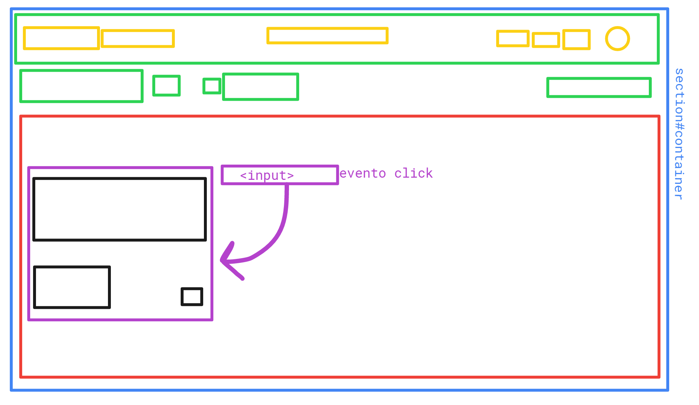

# Trello

## html

  1. Un nav que contiene:
    * div1 ("menu-container")
      - boton para abrir los tableros
      - input para buscador

    * imagen con logo gaurdado en images

    * div2 ("icons-container"):
      - 3 botones con iconos para abrir nuevas pestañas
      - 1 boton con la imagen de perfil

  2. Un main que contiene:
    * 1 div
      - 3 a que abren nuevas pestañas usando DOM
        (dos de ellos con iconos)

      - Un boton el cual abre un menu especial usando DOM

    * 1 form
      - 1 input
        (para añadir una nueva lista)

